# TYNG – Complete Product, Backend & Application Progress Report

**Document type:** Technical and functional audit  
**Classification:** Internal / Client / Investor / QA  
**Prepared from:** Source-code inspection of the Ionic/Angular mobile application (`tyng-angular`) and the Laravel API (`e:\xampp\htdocs\tyng`)  
**Inspection date:** 25 August 2026  
**Audit method:** Static verification of frontend, Laravel routes, controllers, models, migrations, services, middleware, realtime, and deployment files. Live production traffic and a full QA pass were **not** executed.  

**Evidence rule:** A feature is marked implemented only when code proves UI, API, database, and (where claimed) integration. Routes, tables, or screens alone are not treated as complete.

---

## Table of contents

1. [Cover & scope](#tyng--complete-product-backend--application-progress-report)  
2. [Executive summary](#1-executive-summary)  
3. [Project structure audit](#2-project-structure-audit)  
4. [Role-wise product audit](#3-role-wise-product-audit)  
5. [Player features](#4-player-features)  
6. [Venue features](#5-venue-features)  
7. [Admin features](#6-admin-features)  
8. [Booking system audit](#7-booking-system-audit)  
9. [User flows](#8-user-flows)  
10. [API audit](#9-api-audit)  
11. [Database audit](#10-database-audit)  
12. [Frontend–backend integration](#11-frontendbackend-integration-audit)  
13. [Realtime system](#12-realtime-system)  
14. [Security audit](#13-security-audit)  
15. [UI/UX audit](#14-uiux-audit)  
16. [Current implementation status](#15-current-implementation-status)  
17. [Feature matrix](#16-feature-matrix)  
18. [What is complete](#17-what-is-complete)  
19. [What is partially complete](#18-what-is-partially-complete)  
20. [What is missing](#19-what-is-missing)  
21. [What needs testing](#20-what-needs-testing)  
22. [Production readiness](#21-production-readiness)  
23. [Final product flow](#22-final-product-flow)  
24. [Final development status](#23-final-development-status)  
25. [Recommendations](#24-recommendations)

---

## 1. Executive summary

TYNG is a multi-role sports platform: **players** discover venues and other players, create or join games, pay (wallet/TP), chat, and check in; **venues** manage profile, courts, calendar, bookings, and live sessions; **admins** operate a **Laravel Blade web console** (not the Ionic admin screens). A **coach** role exists in signup, onboarding, and many mobile screens, but **coach product APIs were not found**.

The **player booking core** (register/login, create/join/leave, invitations, my bookings, venue list/detail, wallet, discover/friends, notifications, push tokens) is the most complete vertical. The **venue operator app** is substantially wired to Laravel (`/venue/*`, calendar, bookings, session/QR). **Admin** is implemented as a **separate web dashboard** with user CRUD, booking list/calendar/detail, coupons, ads, CMS pages, equipment, wallets, and settings. The Ionic `/app/admin/*` pages are **hard-coded mock UI** and must not be presented as a live admin product.

**Critical gaps (verified):**

- `completed` booking status is defined and counted but **no service was found that sets `booking_status` to `completed`** (session end only sets `session_ended_at`).  
- **Slot conflict UI** on the player venue-booking screen generates local timeslots and does **not** call `GET /venue-slots`.  
- **Google login** is a 501 stub; Apple login is absent.  
- **Login does not reject** `is_blocked` / inactive users.  
- Unauthenticated **`/clear-cache`** and **`/admin/run-migrations`** web routes exist.  
- **Laravel Reverb is packaged but unused**; nearby games and chat use **Firebase Realtime Database**.  
- **No Laravel Policies**; API routes are `auth:sanctum` only (no role middleware). Any authenticated user can hit venue operator endpoints.  
- **Coach, leaderboard, personal stats, Ionic admin, venue analytics “offers”** are largely **frontend-only / mock**.

**Confidence:** **Medium** for architecture and feature classification (code-complete inspection). **Low–Medium** for production behaviour (no end-to-end live run of this audit).

---

## 2. Project structure audit

### 2.1 Frontend (this repository: `tyng-angular`)

| Item | Verified finding |
|------|------------------|
| Framework | Angular **20.3.25** (`package.json`) |
| Ionic | `@ionic/angular` **^8.0.0** |
| Capacitor | **8.4.0** (`@capacitor/android`, App, Camera, Device, Geolocation, Haptics, Keyboard, Push Notifications, Status Bar) |
| Cordova | **Not present** |
| Styling | Tailwind CSS 4, Ionic, SCSS themes |
| Realtime client | `firebase` 12, `laravel-echo` + `pusher-js` **present in package.json but nearby-games client is Firebase RTDB** (`realtime.service.ts` comments: replaces Echo/Reverb) |
| Maps | `@googlemaps/js-api-loader` |
| App ID | `com.tyng.app` (`capacitor.config.ts`) |
| API base | `environment.apiUrl` (local `http://127.0.0.1:8000/api` or production host) |

**Main application structure**

- `src/app/pages/` — splash, welcome, auth, onboarding, player, venue, coach, admin, discover, events, profile, settings, home, tabs  
- `src/app/core/services/` — API, auth, booking, venue, social, chat, wallet, realtime, push, notifications, location, ads, theme  
- `src/app/core/guards/` — `authGuard`, `guestGuard` only (**no role guard**)  
- `src/app/core/interceptors/` — `apiInterceptor` (Bearer `tyng_auth_token`, Accept JSON)  
- `src/app/core/models/` — `api.model.ts`  
- `src/app/shared/components/` — headers, tabs, cards, forms  
- `src/environments/` — API URL + Firebase web config (generated Google Maps key via `sync-env.js`)  
- `android/` — native Android project  

**Routing:** `app-routing.module.ts` — splash → guest auth → `authGuard` for `/app/*` with nested tabs for player, venue, coach, and mock admin.

**Authentication flow (verified):** phone + password register/login via Sanctum token in `localStorage`; session restored via `GET /me` on app init; logout posts `/logout` and clears token.

**Role-based navigation:** `AuthService.navigateAfterAuth` + `TabsPage` tab sets switch on `user.role` (`player` | `coach` | `venue` | `admin`). **Routes are not role-protected**; a player URL can be opened if the user is authenticated.

### 2.2 Backend (`e:\xampp\htdocs\tyng`)

| Item | Verified finding |
|------|------------------|
| Laravel | **12.x** (`laravel/framework ^12.0`) |
| PHP | `^8.2` |
| Auth | **Laravel Sanctum** 4.3 |
| Reverb | Package **laravel/reverb ^1.11** present; `.env.example` sets `BROADCAST_CONNECTION=log` and documents Firebase as the live nearby-games driver |
| Payments | `RazorpayService.php` exists; **wallet top-up API is labelled simulated** (not a live Razorpay checkout in `WalletController`) |
| PDF | `barryvdh/laravel-dompdf` |
| Swagger | `darkaonline/l5-swagger` (presence only; not audited as complete docs) |

**Note:** `e:\tyng_backend` is an **empty directory**. `e:\ting` is a **different, generic Laravel skeleton** (customers/invoices) with **empty `routes/api.php`**. The application API used by this mobile app is **`e:\xampp\htdocs\tyng`**.

**Controllers (API):** Auth, GoogleAuth (stub), Profile, Booking, Venue, VenueEvent, Social, Chat, Wallet, Notification, DeviceToken, Coupon, Equipment, Ad, Theme, Realtime, Game (class exists; **store is not registered in `routes/api.php`**).

**Controllers (Admin web):** Dashboard, User, Booking, Coupon, Ad, Setting, ThemeSetting, Page, SportsEquipment, Wallet, SupportTicket, ContactMessage, Notification, Profile, Login. Legacy Customer/Invoice-style files remain from a template.

**Models:** User, Booking, BookingPlayer, VenueSlot, BookingStatusHistory, CalendarEvent, Game, VenueProfile, VenueCourt, VenueEvent, Friend, PlayerSwipe, BlockedPlayer, Wallet, WalletTransaction, TpPointLedger, Chat*, DeviceToken, Notification, Ad, Coupon, SportsEquipment, Page, ThemeSetting, BookingAttendance, BookingDispute, BookingSessionEvent, PasswordResetCode, Admin, plus leftover Customer/Statement/SupportTicket.

**Services:** Auth, Booking, Profile, PasswordReset, VenueCatalog, Social, Chat, Wallet, SessionAttendance, FirebaseRealtime, PushNotification, Notification, ThemeSetting, Razorpay.

**Repositories:** **Not present** (services used instead).

**Middleware:** AdminAuth, VendorAuth (alias registered), ApiAuth, CheckApiKey (**not applied to `routes/api.php`**), ApiLog, TrustNgrokHosts.

**Policies:** **None**.

**Form requests:** Auth, booking, social, wallet, venue slots, calendar, profile, admin wallet/theme.

**Events / listeners:** `GameCreated`, `GameUpdated` → `PublishNearbyGameToFirebase` (not Reverb broadcast).

**Jobs:** **No custom Jobs directory**. Queue tables exist; `QUEUE_CONNECTION=database` in `.env.example`.

**Notifications (Laravel Notification classes):** **None**; custom `Notification` model + `NotificationService` + FCM `PushNotificationService`.

**Scheduler (`routes/console.php`):** `bookings:expire-pending-approvals` every minute; `wallets:ensure` daily.

### 2.3 Database

See [section 10](#10-database-audit). Engine configured as SQLite in `.env.example`; production likely MySQL (standard Laravel; **not verified on the live server** in this audit).

### 2.4 Infrastructure

| Item | Status |
|------|--------|
| Nginx | Referenced in `.github/workflows/deploy.yml` (`systemctl reload nginx`). **No nginx vhost file in the repo.** ⚠️ Needs Verification |
| PHP-FPM | **Not in repo.** ⚠️ Needs Verification |
| MySQL/MariaDB | **Not confirmed**; `.env.example` defaults to SQLite |
| Laravel Reverb process | Config file present; **product path uses Firebase**. ⚠️ Needs Verification if Reverb is still running on VPS |
| Supervisor / queue workers | **Not in repo.** Scheduler commands exist. ⚠️ Needs Verification |
| Cron / scheduler | Commands defined; **host crontab not in repo.** ⚠️ Needs Verification |
| CI/CD | GitHub Actions SSH deploy to `/var/www/tyng` on `main`: pull, composer, migrate, optimize, nginx reload |
| Environments | Laravel `.env.example` (Firebase, FCM, CORS, Sanctum). Angular `.env.example` (Google Maps only) |

---

## 3. Role-wise product audit

### A. Player — user perspective

The player installs the app, sees splash/welcome, registers or logs in with **Indian mobile number + password**, optionally completes **onboarding** (sports, experience, formats, availability — saved via profile API). They land on **Home**: greeting, location (GPS/geocode), ads, nearby games (API + Firebase live updates). They can **search** venues/players/coaches, **browse venues**, open **venue detail**, pick date/time (see integration caveats), pay on **summary** (wallet/coupon), or **create a game** (sport, venue from API, date/time, capacity) which calls **`POST /book-game`**. They see **My Bookings** (upcoming / invited / past / cancelled / completed segments, pull-to-refresh, countdown for pending venue approval). They can **join** open games, **leave**, **invite** friends (API), **accept/reject** invites, **chat** (Laravel thread + Firebase messages), **discover** players (swipe), manage **friends**, receive **in-app + push** notifications, use **wallet/TP**, and **check in** with a token/QR.

**They cannot (verified):** Google/Apple login; full bio/DOB editor on Edit Profile; reliable occupancy-aware slot picking on venue-booking; coach marketplace from live data; real personal stats/leaderboard; block a player from the social API.

### B. Venue — user perspective

A venue user signs up with role Venue, completes **venue onboarding** and **complete profile** (business, location, galleries, documents, courts, equipment). They use a **dashboard** fed by `GET /venue/dashboard` (today’s bookings, revenue, occupancy, pending requests, courts). They approve/cancel bookings, open **calendar** (`GET /calendar`), manage **facilities/courts**, view **earnings**, create **venue events**, run **live session** (start/end, QR, manual check-in), cycle amenities, raise disputes. **Analytics page is static mock.** **Create Offer** on dashboard points at analytics (not a coupon-create API for venues).

### C. Admin — user perspective

**Real admin product:** browser login at Laravel `/` → Blade **admin dashboard** (counts of venues, coaches, players, bookings). Admin can CRUD **users**, filter by role/city, activate flags, send push, unblock venue booking; **list/filter/view bookings** and a **booking calendar**; manage **coupons, ads, CMS pages, sports equipment, theme, settings, wallets (credit/debit/TP), support tickets, contact messages**. Admin **does not** (from routes) cancel or change booking status from a dedicated action — **show is read-oriented**.

**Ionic admin screens** (`/app/admin/dashboard`, users, venues, revenue, disputes, settings) show **sample numbers and names** and **do not call Laravel**.

---

## 4. Player features

| Feature | User perspective | Frontend | Backend | Database | API/Integration | Overall | Notes |
|---------|------------------|----------|---------|----------|-----------------|---------|-------|
| Login | Phone + password | ✅ | ✅ | ✅ | ✅ | ✅ | Sanctum token |
| Signup | Name, phone, email, password, role | ✅ | ✅ | ✅ | ✅ | ✅ | Roles Player/Coach/Venue |
| Logout | Clears session / device | ✅ | ✅ | ✅ | ✅ | ✅ | |
| OTP (login) | — | 🔴 | 🔴 | 🟡 | 🔴 | 🔴 | OTP only for **password reset** |
| Google login | Button hidden; handler message | 🟣 hidden | 🔵 501 stub | 🔴 | 🔴 | 🔴 | `POST /api/auth/google` |
| Apple login | — | 🔴 | 🔴 | 🔴 | 🔴 | 🔴 | |
| Forgot/reset password | Phone OTP then new password | ✅ | ✅ | ✅ `password_reset_codes` | ✅ | ✅ | OTP returned in debug |
| Session/token | Bearer interceptor | ✅ | ✅ | ✅ `personal_access_tokens` | ✅ | ✅ | Login does not check block/active |
| View profile | Profile tab | ✅ | ✅ `/me` | ✅ | ✅ | ✅ | |
| Edit profile | Name, phone, email, location, photo | ✅ | ✅ | ✅ | ✅ | 🟡 | **No bio/DOB/position/time** in `UpdateProfileRequest` |
| Bio / DOB / preferred position / time | Columns exist | 🟣 limited | 🔴 not in update API | ✅ columns | 🔴 | 🟡 | DB only |
| Rating / games played | Shown on user resource | 🟡 | 🟡 | ✅ | ⚠️ | ⚠️ | Updates not fully traced to every game |
| Profile image | Camera/library upload | ✅ | ✅ | ✅ | ✅ | ✅ | Multipart POST spoof PUT |
| Venue listing | Venues tab | ✅ | ✅ | ✅ | ✅ | ✅ | |
| Venue details | Detail page | ✅ | ✅ | ✅ | 🟡 | 🟡 | Fallback `VENUE_DATA` mock if API fails |
| Venue search | Search page + query | ✅ | ✅ `/search` | ✅ | ✅ | ✅ | |
| Venue filtering | Venues page filters | 🟡 | 🟡 query params | ✅ | ⚠️ | 🟡 | |
| Location/map | Live map + GPS | ✅ | 🟡 venues list | ✅ coords on profile | 🟡 | 🟡 | Google Maps; Lucknow bias in code |
| Available slots | Create-game local grid; venue-book local grid | 🟡 | ✅ `GET /venue-slots` | ✅ | 🟣 FE often unused | 🟡 | **Venue-booking does not call slots API** |
| Sports types | Hard-coded sports + venue sports | ✅ | ✅ | ✅ | ✅ | ✅ | |
| Create game | Multi-step create | ✅ | ✅ `book-game` | ✅ | ✅ | ✅ | Also creates `games` row via booking service |
| Select venue/date/time/sport/capacity/duration | Create-game wizard | ✅ | ✅ | ✅ | ✅ | ✅ | |
| Game status | Shown on cards | ✅ | ✅ | ✅ | ✅ | 🟡 | `completed` rarely if ever set |
| Add/invite players | Booking APIs + UI | ✅ | ✅ | ✅ | ✅ | ✅ | |
| Join / leave | Game detail / cards | ✅ | ✅ | ✅ | ✅ | ✅ | |
| View participants | Booking detail | ✅ | ✅ | ✅ | ✅ | ✅ | |
| Accept/reject invite | My bookings invited | ✅ | ✅ | ✅ | ✅ | ✅ | |
| Full booking | Status `full` when capacity met | ✅ | ✅ | ✅ | ✅ | ✅ | |
| Cancellation | Host/venue cancel | ✅ | ✅ | ✅ | ✅ | ✅ | Refunds via wallet service paths |
| Completion | Session end ≠ completed status | 🟡 | 🟡 | ✅ column | 🟡 | 🟡 | See booking audit |
| Expiration | Auto expire/cancel pending | 🟡 UI | ✅ command + service | ✅ | ⚠️ scheduler on host | 🟡 | |
| My bookings list | Segments, refresh, empty, error, countdown | ✅ | ✅ | ✅ | ✅ | ✅ | |
| Discover swipe | Tinder-style cards | ✅ | ✅ | ✅ swipes | ✅ | ✅ | Client-side extra filters |
| Friends add/remove | Friends page | ✅ | ✅ | ✅ | ✅ | ✅ | |
| Block player | Table + chat/social filter | 🔴 UI API | 🟡 used internally | ✅ | 🔴 no block endpoint | 🔵 | |
| Notifications feed | List, read, delete | ✅ | ✅ | ✅ | ✅ | ✅ | |
| Push | Capacitor + FCM | ✅ | ✅ device tokens | ✅ | ⚠️ | ⚠️ | Needs device QA |
| Realtime nearby | Home/ongoing | ✅ | ✅ Firebase publish | n/a RTDB | ✅ | ⚠️ | Needs live QA |
| Chat | List + room | ✅ | ✅ threads + RTDB | ✅ | ✅ | ⚠️ | |
| Wallet / TP | Balance, simulated top-up, convert | ✅ | ✅ | ✅ | ✅ | 🟡 | Top-up **simulated** |
| Check-in | Token page | ✅ | ✅ | ✅ attendance | ✅ | ⚠️ | |
| Coaches directory | Hard-coded coaches | 🟣 | 🟡 search returns coaches users | ✅ users | 🟡 search only | 🟣 | Dedicated coaches page is mock |
| Leaderboard | Static list | 🟣 | 🔴 | 🔴 | 🔴 | 🟣 | |
| Personal stats | Static “Arjun Sharma” | 🟣 | 🔴 | 🟡 user stats fields | 🔴 | 🟣 | |
| Ads | Home banners | ✅ | ✅ | ✅ ads | ✅ | ✅ | Admin-managed |

---

## 5. Venue features

| Feature | User perspective | Frontend | Backend | Database | Integration | Overall | Notes |
|---------|------------------|----------|---------|----------|-------------|---------|-------|
| Venue login | Same auth, role venue | ✅ | ✅ | ✅ | ✅ | ✅ | No separate venue API auth |
| Venue profile | Profile + complete profile | ✅ | ✅ | ✅ `venue_profiles` | ✅ | ✅ | |
| Location | Maps embed / Places | ✅ | ✅ | ✅ | ✅ | ✅ | |
| Sports / courts | Facilities | ✅ | ✅ courts API | ✅ | ✅ | ✅ | |
| Slot interval / open-close | Profile + generate slots | ✅ | ✅ | ✅ | 🟡 player slot UI | 🟡 | |
| Booking calendar | Month view | ✅ | ✅ `/calendar` | ✅ `calendar_events` | ✅ | ✅ | |
| Upcoming/past bookings | Bookings list | ✅ | ✅ my-bookings | ✅ | ✅ | ✅ | |
| Booking details / players | Detail + session | ✅ | ✅ | ✅ | ✅ | ✅ | |
| Slot conflicts | Backend on create | 🟡 player UI | ✅ overlap checks | ✅ `venue_slots` | 🟡 | 🟡 | Player book screen mock unavailable |
| Approve / cancel | Venue actions | ✅ | ✅ | ✅ | ✅ | ✅ | Pending + deadline expire |
| Dashboard | Pulse metrics | ✅ | ✅ `/venue/dashboard` | ✅ | ✅ | ✅ | |
| Earnings | Period report | ✅ | ✅ `/venue/earnings` | ✅ | ✅ | ✅ | |
| Revenue analytics page | Pretty charts | 🟣 mock | 🟡 earnings API unused here | ✅ | 🔴 | 🟣 | |
| Venue events | Hub + create | ✅ | ✅ `/venue/events` | ✅ | ✅ | ⚠️ | |
| Notifications | Venue notifications page | ✅ | ✅ notifications API | ✅ | ⚠️ | ⚠️ | |
| Reports | Admin-side more than venue | 🟡 | 🟡 | ✅ | ⚠️ | 🟡 | |
| Payments | Wallet amounts on bookings | 🟡 | 🟡 simulated wallet | ✅ | 🟡 | 🟡 | No live PSP for venue payouts found |

**Venue APIs are connected** for dashboard, profile, courts, gallery, documents, earnings, calendar, bookings, session, events. **Not connected:** Ionic analytics mock, “Create Offer”.

---

## 6. Admin features

There are **two admin UIs**. Status below is for the **Laravel Blade admin** unless noted.

| Feature | User perspective | Admin UI | Backend | Database | Ionic admin | Overall |
|---------|------------------|----------|---------|----------|-------------|---------|
| Dashboard counts | Venues, coaches, players, bookings | ✅ Blade | ✅ | ✅ | 🟣 fake stats | 🟡 split |
| Charts / revenue dashboard | — | 🔴 Blade simple counts | 🔴 no chart API | 🟡 bookings | 🟣 fake ₹24.5L | 🔴 / 🟣 |
| User list/search/filter | Ajax table | ✅ | ✅ | ✅ | 🟣 hardcoded | ✅ Blade |
| View/edit user | Resource | ✅ | ✅ | ✅ | 🔴 | ✅ |
| Activate user | `is_active` | ✅ | ✅ | ✅ | 🔴 | ✅ |
| Block/unblock | `is_blocked`, venue unblock | 🟡 | ✅ fields + unblock-venue | ✅ | 🟣 fake banned | 🟡 |
| Delete user | Resource destroy | ✅ | ✅ | ✅ | 🔴 | ✅ |
| User booking history | Via user/booking screens | ⚠️ | ⚠️ | ✅ | 🔴 | ⚠️ |
| Add/edit venue as user | Users with role Venue | 🟡 users CRUD | ✅ | ✅ | 🟣 | 🟡 not a dedicated venue CMS |
| Venue approval | Booking approval is venue-side | 🔴 dedicated | 🟡 booking pending | ✅ | 🔴 | 🔴 as “venue KYC approval product” |
| Bookings list/filter | Status, sport, date, venue, city | ✅ | ✅ | ✅ | 🔴 | ✅ |
| Booking detail / participants | Show page | ✅ | ✅ | ✅ | 🔴 | ✅ |
| Cancel / change status | — | 🔴 no route found | 🔴 admin cancel | ✅ | 🔴 | 🔴 |
| Calendar | Admin bookings calendar | ✅ | ✅ | ✅ | 🔴 | ✅ |
| Sports equipment | CRUD | ✅ | ✅ | ✅ | 🔴 | ✅ |
| Coupons | CRUD | ✅ | ✅ + API validate | ✅ | 🔴 | ✅ |
| Ads / banners | CRUD | ✅ | ✅ + API `/ads` | ✅ | 🔴 | ✅ |
| Pages (CMS) | CRUD | ✅ | ✅ | ✅ | 🔴 | ✅ |
| FAQs / Terms / Privacy | Via pages if seeded | ⚠️ | ✅ pages | ✅ | 🔴 | ⚠️ content-dependent |
| Support tickets / contact | List/reply/close | ✅ | ✅ | ✅ | 🔴 | ✅ |
| Wallets / TP grant | Credit/debit/TP | ✅ | ✅ | ✅ | 🔴 | ✅ |
| Disputes admin | — | 🔴 no admin disputes routes | 🔵 API create dispute | ✅ `booking_disputes` | 🟣 fake cases | 🔵 / 🟣 |
| Theme | Brand colors | ✅ | ✅ + `/app/theme` | ✅ | 🔴 | ✅ |
| Settings | App settings | ✅ | ✅ | ✅ | 🟣 | ✅ |
| Admin roles / policies | Single `admin` middleware | 🟡 | 🟡 AdminAuth | ✅ admins table | 🔴 | 🟡 no RBAC |
| Send push to user | Button | ✅ | ✅ | ✅ | 🔴 | ⚠️ FCM |

---

## 7. Booking system audit

### 7.1 Tables and relationships

```
users (host, venue, players)
  └── games (legacy/create metadata; booking.game_id FK)
        └── bookings
              ├── booking_players (user_id, role, status)
              ├── venue_slots (one slot row reserved per booking)
              ├── booking_status_history
              ├── calendar_events (1:1 booking)
              ├── booking_attendances
              ├── booking_session_events
              ├── booking_disputes
              └── wallet_transactions (optional)
venue_profiles / venue_courts belong to users (role Venue)
```

`venue_id` on bookings **references `users.id`** (the venue user), not a separate venues table.

### 7.2 Booking statuses (code constants — `App\Models\Booking`)

Only these exist:

- `pending` — awaiting venue approval (when venue requires it)  
- `confirmed` — approved / open  
- `full` — `current_players >= total_players`  
- `cancelled` — host/venue cancel, or auto-cancel if venue does not approve in time  
- `completed` — **constant and filters exist; setter not found**  
- `expired` — auto-expire path in `BookingService` for elapsed bookings  

**Payment statuses (frontend model):** `pending` | `paid` | `failed` | `refunded`.

**Player row statuses (verified in `BookingService`):** `host`, `joined`, `invited`, `left` (plus reject/cancel flows).

**Venue slot statuses (create + queries):** `reserved`, `confirmed`, `full`, plus cancelled/expired updates.

### 7.3 Happy path (implemented)

```
Select venue & slot (create-game uses venue list API; venue-booking uses local slots)
  → POST /book-game
  → Game row + Booking + host BookingPlayer + VenueSlot + CalendarEvent + status history
  → If venue approval required: status pending + approval_deadline_at
  → Else confirmed (or full if capacity 1)
  → Invite: POST /booking/{id}/invite → status invited
  → Join: POST /join-booking or accept invite
  → Recalc current_players → confirmed or full
  → Venue may start session (QR/check-in)
  → Venue ends session (attendance marked absent if awaiting)
  → ⚠️ booking_status may remain confirmed/full (not completed)
```

### 7.4 Cancellation and expiration

- **Cancel:** `DELETE /cancel-booking` (host or venue). Status `cancelled`; slot/calendar updated; wallet refunds where implemented.  
- **Pending approval timeout:** `ExpirePendingVenueApprovals` + `BookingService` auto-cancel to `cancelled` (notes: venue did not approve).  
- **Expired:** service can set `expired` when the booking datetime has passed (needs scheduler/runtime verification).  
- **Leave:** non-host `joined` → `left`; capacity and status recalculated.

---

## 8. User flows

### FLOW 1 – Player registration / login

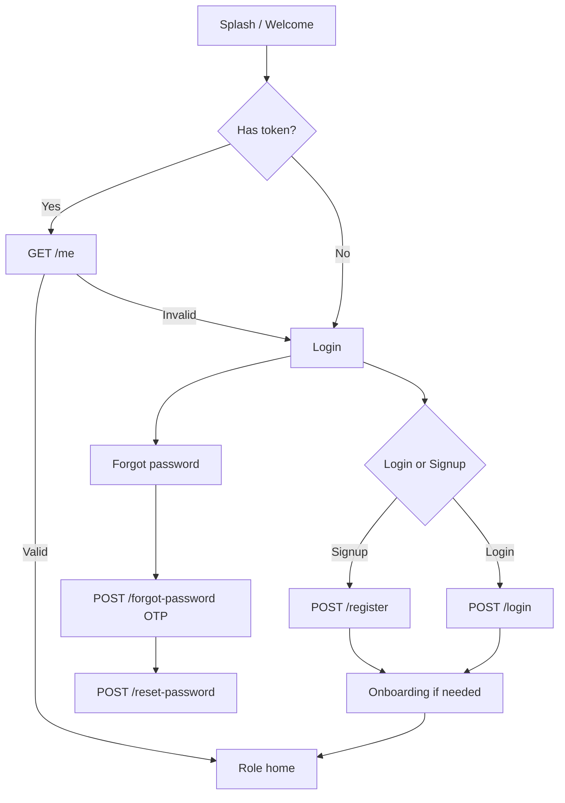

### FLOW 2 – Player creates game

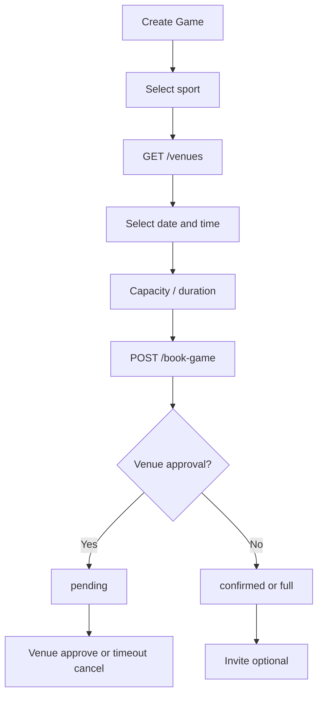

### FLOW 3 – Player joins game

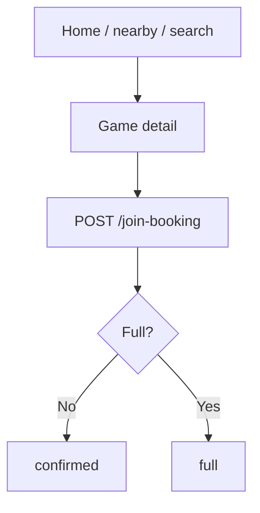

### FLOW 4 – Player leaves game

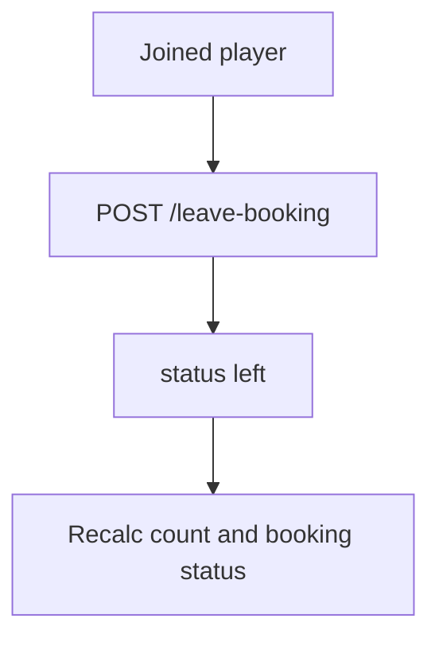

### FLOW 5 – Invite another player

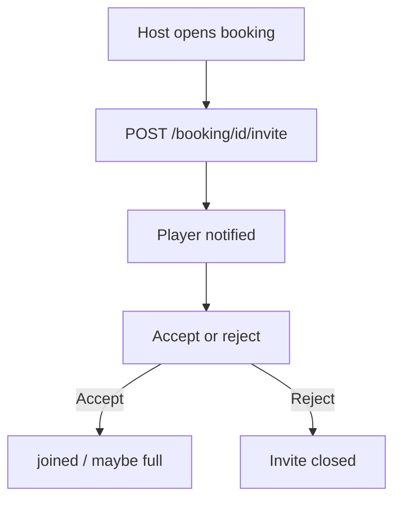

### FLOW 6 – Discover / friends

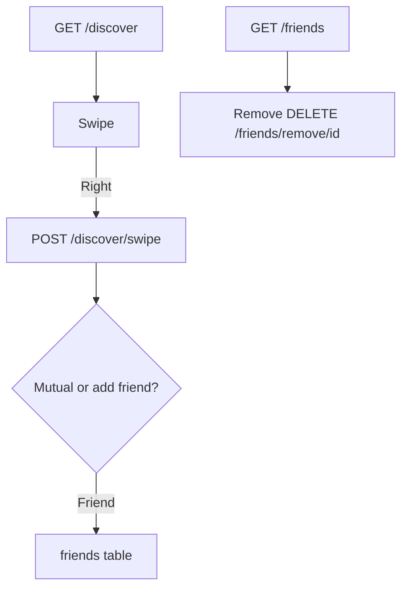

### FLOW 7 – Venue calendar and slots

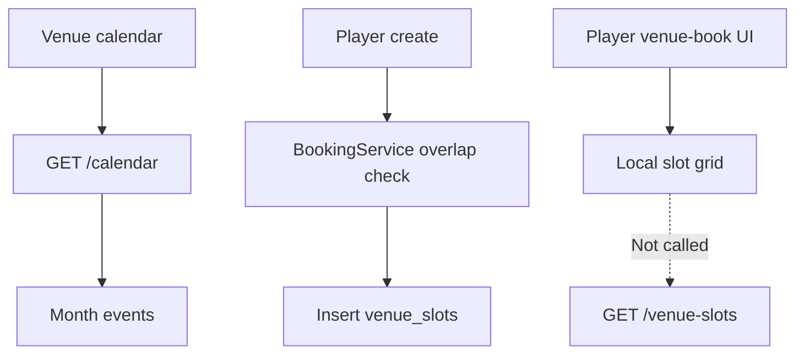

### FLOW 8 – Admin user management

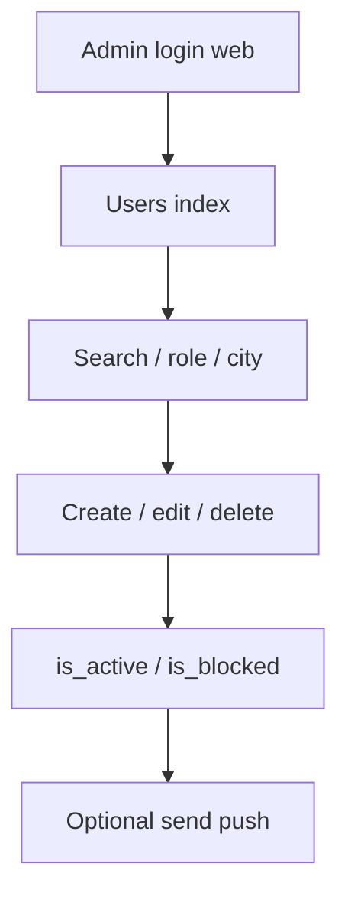

### FLOW 9 – Admin venue management

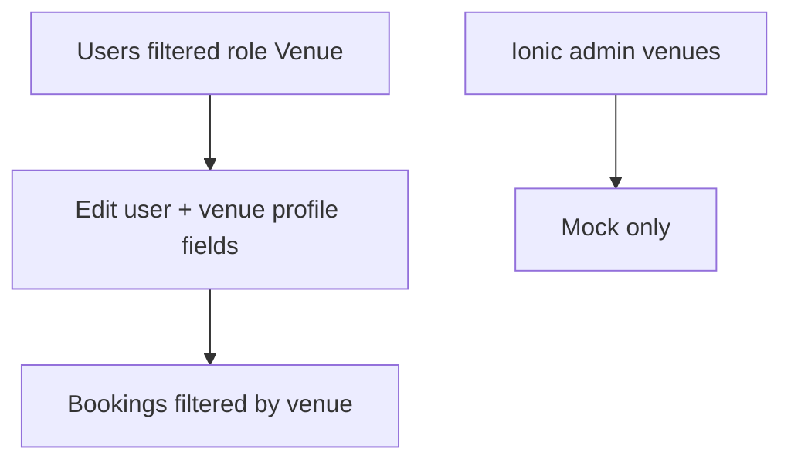

### FLOW 10 – Admin booking management

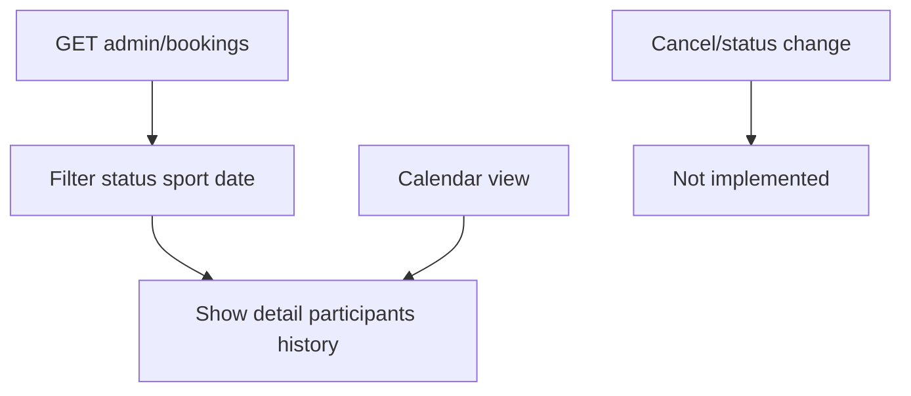

### FLOW 11 – Complete booking lifecycle

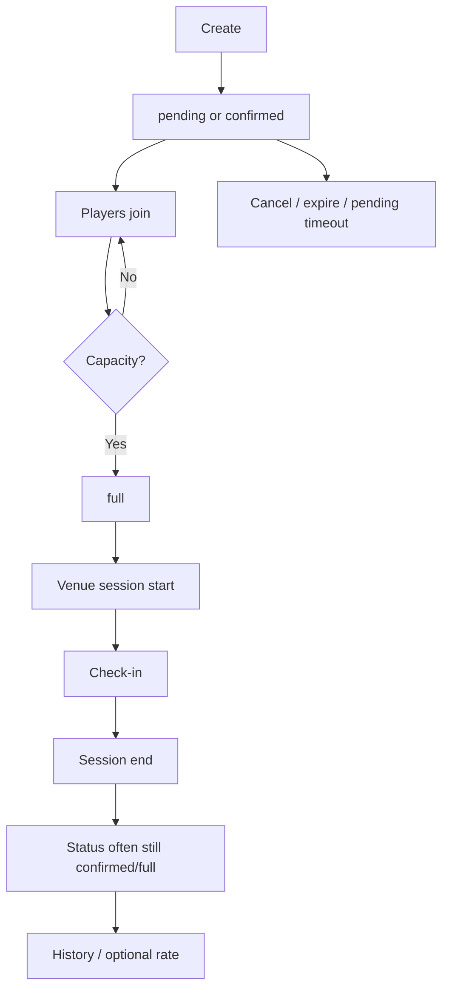

---

## 9. API audit

**Prefix:** `/api`. **Auth:** `auth:sanctum` unless noted. **Role middleware:** none on these routes.

### Authentication

| Method | Endpoint | Controller | Auth | Role | Purpose | Frontend | DB | Status |
|--------|----------|------------|------|------|---------|----------|-----|--------|
| POST | `/register` | AuthController@register | No | — | Register | Used | users | ✅ |
| POST | `/login` | AuthController@login | No | — | Login | Used | users, tokens | ✅ |
| POST | `/logout` | AuthController@logout | Yes | — | Logout | Used | tokens, device_tokens | ✅ |
| POST | `/forgot-password` | AuthController@forgotPassword | No | — | OTP | Used | password_reset_codes | ✅ |
| POST | `/reset-password` | AuthController@resetPassword | No | — | Reset | Used | users | ✅ |
| POST | `/change-password` | AuthController@changePassword | Yes | — | Change password | Used | users | ✅ |
| POST | `/auth/google` | GoogleAuthController@login | No | — | Google | Not used (hidden) | — | 🔴 501 |
| GET | `/me` | AuthController@me | Yes | — | Current user | Used | users | ✅ |

### Profiles / users

| Method | Endpoint | Controller | Auth | Purpose | Frontend | Status |
|--------|----------|------------|------|---------|----------|--------|
| PUT/POST | `/profile` | ProfileController@update | Yes | Update profile / image | Used | ✅ |

### Venues

| Method | Endpoint | Controller | Auth | Purpose | Frontend | Status |
|--------|----------|------------|------|---------|----------|--------|
| GET | `/venues` | VenueController@index | Yes | List | Used | ✅ |
| GET | `/venues/{id}` | VenueController@show | Yes | Detail | Used | ✅ |
| GET | `/venue/dashboard` | VenueController@dashboard | Yes | Venue home | Used | ✅ |
| GET | `/venue/earnings` | VenueController@earnings | Yes | Earnings | Used | ✅ |
| GET/PUT | `/venue/profile` | VenueController | Yes | Operator profile | Used | ✅ |
| POST | `/venue/gallery` | VenueController | Yes | Photos | Used | ✅ |
| POST | `/venue/documents` | VenueController | Yes | KYC docs | Used | ✅ |
| POST/PUT/DELETE | `/venue/courts` | VenueController | Yes | Courts | Used | ✅ |
| GET/POST | `/venue/events` | VenueEventController | Yes | Events | Used | ✅ |
| GET | `/equipment` | EquipmentController | Yes | Rental catalog | Used | ✅ |

### Bookings / games / slots / calendar

| Method | Endpoint | Controller | Purpose | Frontend | Status |
|--------|----------|------------|---------|----------|--------|
| POST | `/book-game` and `/games` | BookingController@bookGame | Create booking | Used (create-game, summary) | ✅ |
| GET | `/my-bookings` | myBookings | Lists | Used | ✅ |
| GET | `/nearby-games` | nearbyGames | Discovery | Used | ✅ |
| GET | `/search` | search | Games/players/venues/coaches | Used | ✅ |
| GET | `/booking/{id}` | show | Detail | Used | ✅ |
| POST | `/join-booking` | join | Join | Used | ✅ |
| POST | `/leave-booking` | leave | Leave | Used | ✅ |
| PUT | `/update-booking` | update | Update | ⚠️ | ⚠️ |
| DELETE | `/cancel-booking` | cancel | Cancel | Used | ✅ |
| POST | `/approve-booking` and `/booking/{id}/approve` | approve | Venue approve | Used | ✅ |
| GET | `/venue-slots` | venueSlots | Occupied/generated slots | **Mostly unused by venue-book UI** | 🟡 |
| GET | `/calendar` | calendar | Calendar | Venue calendar used | ✅ |
| GET | `/upcoming-bookings` | upcoming | Upcoming | ⚠️ | ⚠️ |
| GET | `/past-bookings` | past | Past | ⚠️ | ⚠️ |
| GET | `/booking/{id}/players` | players | Roster | Used | ✅ |
| POST | `/booking/{id}/invite` | invite | Invite | Used | ✅ |
| PUT | `/booking/{id}/player/{player}` | updatePlayer | Roster edit | ⚠️ | ⚠️ |
| DELETE | `/booking/{id}/player/{player}` | removePlayer | Remove | ⚠️ | ⚠️ |
| GET | `/my-invited-bookings` | myInvitedBookings | Invites | Used via my-bookings | ✅ |
| POST | `/booking/invite/accept` | acceptInvite | Accept | Used | ✅ |
| POST | `/booking/invite/reject` | rejectInvite | Reject | Used | ✅ |
| POST | `/booking/{id}/disputes` | createDispute | Dispute | Venue detail | ✅ |
| POST | `/booking/{id}/amenities/cycle` | cycleAmenity | Amenity | Venue session | ✅ |
| POST | `/booking/{id}/session/start\|end\|qr` | SessionAttendance | Live session | Venue | ✅ |
| POST | `/booking/{id}/session/check-in` | manualCheckIn | Staff check-in | Venue | ✅ |
| POST | `/booking/check-in` | checkIn | Player token | Check-in page | ✅ |
| POST | `/booking/{id}/captain-continue` | captainContinue | Captain | ⚠️ | ⚠️ |
| PUT | `/booking/{id}/rules` | updateRules | Rules | ⚠️ | ⚠️ |
| POST | `/booking/{id}/rate` | rate | 1–5 rating | ⚠️ | 🟡 blocked until completed/expired/past |

**GameController@store** exists but is **not routed**. Creating a game goes through **BookingController**.

### Friends / discovery

| Method | Endpoint | Frontend | Status |
|--------|----------|----------|--------|
| GET | `/discover` | Used | ✅ |
| POST | `/discover/swipe` | Used | ✅ |
| GET | `/friends` | Used | ✅ |
| POST | `/friends/add` | Used | ✅ |
| DELETE | `/friends/remove` and `/friends/remove/{player}` | Used | ✅ |

### Notifications / devices / ads / theme / realtime / wallet / coupons

| Method | Endpoint | Frontend | Status |
|--------|----------|----------|--------|
| GET | `/notifications` | Used | ✅ |
| GET | `/notifications/badges` | Used | ✅ |
| POST | `/notifications/bookings/seen` | Used | ✅ |
| POST | `/notifications/read-all` | Used | ✅ |
| POST | `/notifications/{id}/read` | Used | ✅ |
| DELETE | `/notifications/{id}` | Used | ✅ |
| POST/DELETE | `/device-token` | Used | ✅ |
| GET | `/ads` | Used | ✅ |
| GET | `/app/theme` | Used | ✅ |
| GET | `/realtime/config` | Used (no auth) | ✅ |
| GET | `/wallet` | Used | ✅ |
| GET | `/wallet/transactions` | Used | ✅ |
| POST | `/wallet/topup` | Used (simulated) | 🟡 |
| POST | `/wallet/convert-tp` | Used | ✅ |
| POST | `/coupons/validate` | Used | ✅ |

### Chat

| Method | Endpoint | Frontend | Status |
|--------|----------|----------|--------|
| GET | `/chats` | Used | ✅ |
| GET | `/chats/{chatId}` | Used | ✅ |
| POST | `/chats/private` | Used | ✅ |
| POST | `/chats/game/{bookingId}` | Used | ✅ |
| GET/POST | `/chats/{chatId}/messages` | Hybrid RTDB | ✅ |
| POST | `/chats/{chatId}/read` | Used | ✅ |
| POST | `/chats/{chatId}/pin` | Used | ✅ |

### Admin (web, not `/api`)

Session + `admin` middleware. Resource users, bookings index/show/calendar, coupons, ads, pages, equipment, wallets, settings, theme, support, contact. **Not JSON APIs for the Ionic app.**

### Other / unused / dangerous web

| Method | Endpoint | Auth | Status |
|--------|----------|------|--------|
| GET | `/clear-cache` | **None** | 🔴 security |
| GET | `/admin/run-migrations` | **None** | 🔴 security |
| GET | `/up` | Health | ✅ Laravel |

---

## 10. Database audit

Migrations live under `database/migrations/` (users, cache, jobs, profile fields, Sanctum, password reset codes, games, bookings cluster, social, notifications mobile fields, venue profiles/courts, equipment, coupons, documents, wallets, device tokens, ads, theme, chat, disputes, session attendance, venue events, amenities, captain, TP points, slot interval, push flags).

| Table | Purpose | Important columns | Relationships | FE | BE | Status |
|-------|---------|-------------------|---------------|----|----|--------|
| users | All roles | role, phone, password, is_onboarded, is_active, is_blocked, sports JSON, rating, games_played, bio, dob, preferred_*, tp_*, xp | bookings, venueProfile, friends | ✅ | ✅ | ✅ |
| games | Game metadata | sport, venue_id, date, time, team_size | bookings | via booking | ✅ | 🟡 venue_id not FK in migration |
| bookings | Core | booking_status, payment_*, times, price, totals, approval_deadline_at, session_*, checkin_token | players, slot, calendar | ✅ | ✅ | ✅ |
| booking_players | Roster | role, status, rating, amount_paid | booking, user | ✅ | ✅ | ✅ |
| venue_slots | Occupancy | slot_date, times, status | booking, venue user | 🟡 | ✅ | ✅ |
| booking_status_history | Audit | from/to, changed_by | booking | ⚠️ | ✅ | ✅ |
| calendar_events | Venue calendar | event_date, title, status, meta | booking 1:1 | ✅ venue | ✅ | ✅ |
| friends | Graph | user_one_id, user_two_id | users | ✅ | ✅ | ✅ |
| player_swipes | Discover | direction left/right | users | ✅ | ✅ | ✅ |
| blocked_players | Blocks | user_id, blocked_user_id | users | 🔴 | 🟡 filter | 🔵 |
| venue_profiles | Venue KYC | address, hours, slot_interval, documents JSON | user | ✅ | ✅ | ✅ |
| venue_courts | Facilities | meta JSON, prices | venue user | ✅ | ✅ | ✅ |
| venue_events | Tournaments | — | venue | ✅ | ✅ | ✅ |
| wallets / wallet_transactions / tp_point_ledger | Money & TP | — | user, booking | ✅ | ✅ | ✅ |
| chat_threads / members / messages | Chat persistence | — | users, booking | ✅ | ✅ | ✅ |
| device_tokens | FCM | token, device_id, is_logged_in | user | ✅ | ✅ | ✅ |
| notifications | In-app | mobile fields | user | ✅ | ✅ | ✅ |
| ads, coupons, sports_equipment, pages, theme_settings, app_settings | Admin CMS | — | — | partial | ✅ | ✅ |
| booking_attendances / booking_session_events | Live session | status awaiting/checked_in/late/absent | booking | ✅ venue | ✅ | ✅ |
| booking_disputes | Player/venue disputes | message | booking | venue create | ✅ | 🟡 no admin UI |
| password_reset_codes | OTP | phone, code | — | ✅ | ✅ | ✅ |
| personal_access_tokens | Sanctum | — | users | ✅ | ✅ | ✅ |
| jobs / cache / sessions | Infra | — | — | — | ✅ | ✅ |
| admins | Web admin | — | — | Blade | ✅ | ✅ |

### ER (simplified)

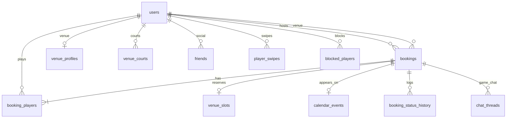

---

## 11. Frontend–backend integration audit

| Feature | UI | Service | API | DB | Integrated | Status |
|---------|----|---------|-----|----|------------|--------|
| Auth login/register | Yes | auth.service | Yes | Yes | Yes | ✅ |
| Google | Hidden button | No | 501 | No | No | 🔴 |
| Profile edit | Yes | auth | Yes | Yes | Partial fields | 🟡 |
| Home nearby games | Yes | booking + realtime | Yes | Yes | Yes | ✅ |
| Home ads | Yes | ad.service | Yes | Yes | Yes | ✅ |
| Create game | Yes | booking | book-game | Yes | Yes | ✅ |
| Venue list | Yes | venue.service | Yes | Yes | Yes | ✅ |
| Venue detail | Yes | venue.service | Yes | Yes | Fallback mock | 🟡 |
| Venue book slots | Yes | **No slots call** | Exists | Yes | **No** | 🟣/🟡 |
| Booking summary pay | Yes | booking + wallet | Yes | Yes | Yes (wallet sim) | 🟡 |
| My bookings | Yes | booking | Yes | Yes | Yes | ✅ |
| Join game | Yes | booking | Yes | Yes | Yes | ✅ |
| Discover | Yes | social | Yes | Yes | Yes | ✅ |
| Friends | Yes | social | Yes | Yes | Yes | ✅ |
| Chat | Yes | chat.service | Yes + Firebase | Yes | Yes | ⚠️ |
| Notifications | Yes | notification-feed | Yes | Yes | Yes | ✅ |
| Wallet | Yes | wallet | Yes | Yes | Simulated top-up | 🟡 |
| Venue dashboard | Yes | venue | Yes | Yes | Yes | ✅ |
| Venue calendar | Yes | booking calendar | Yes | Yes | Yes | ✅ |
| Venue analytics | Yes | No | Earnings unused | — | No | 🟣 |
| Coach students/sessions | Yes | No | No | No | No | 🟣 |
| Leaderboard / stats | Yes | No | No | No | No | 🟣 |
| Ionic admin | Yes | No | No | No | No | 🟣 |
| Blade admin | Yes (web) | Blade | Web | Yes | Yes | ✅ |
| Theme | App | theme.service | Yes | Yes | Yes | ✅ |
| Push token | Native | push-notification | Yes | Yes | Yes | ⚠️ |

Screens that are **UI/mock only** include: coach students/plan/evaluate/earnings/insights (static data), coaches directory page, stats, leaderboard, Ionic admin suite, venue analytics, design-data leftover games/players.

---

## 12. Realtime system

| Topic | Finding |
|-------|---------|
| BROADCAST_CONNECTION | `.env.example`: **`log`**. Firebase documented as replacement for Reverb. |
| Reverb config | `config/reverb.php` present; keys commented as unused. |
| Events | `GameCreated` / `GameUpdated` — **not** `ShouldBroadcast` to Reverb; listeners publish to **Firebase RTDB**. |
| Channels | `routes/channels.php` only `App.Models.User.{id}` (Sanctum broadcasting auth for Echo — **unused by current mobile nearby client**). |
| Frontend | `RealtimeService` listens to Firebase `nearby-games` (+ user bookings path). Home / venue dashboard subscribe. Chat uses Firebase `chats` / `userChats`. |
| Auth | RTDB rules file referenced in `.env.example` comments (client read-only nearby; chats writable). **Production rules ⚠️ Needs Verification.** |
| Supervisor | Not in repo. |

**What exists:** live nearby game create/update; chat live messages; session publish helper in `SessionAttendanceService`.  

**Needs testing:** Android background, rule lockdown, duplicate events, Echo leftover packages, production Firebase credentials vs Angular `environment.ts`.

---

## 13. Security audit

**Do not treat this as a pentest.** No secrets from live `.env` are reproduced here.

| Area | Finding | Severity |
|------|---------|----------|
| Authentication | Sanctum personal access tokens; interceptor Bearer | OK pattern |
| Login blockers | **No check** of `is_blocked` / `is_active` on login | High |
| Authorization | **No policies**; **no role middleware** on API | High |
| Admin | Session `AdminAuth`; **migrations and cache-clear unauthenticated** | Critical |
| Validation | Form requests on core booking/auth | Good |
| Mass assignment | `$fillable` on models | Standard; API still role-open |
| SQL injection | Eloquent / bound queries generally; some `whereRaw` with bound params | Medium review |
| CSRF | API stateless; web admin uses session | OK if cookies set |
| CORS | `CORS_ALLOW_ALL` default **true** (`*`) | High for production |
| Rate limiting | Laravel password broker throttle config; **API login not clearly throttled** | Medium |
| File upload | Profile image mime/size checks | OK-ish; gallery/docs ⚠️ |
| Passwords | Hashed (`hashed` cast / Hash) | OK |
| Token security | Stored in `localStorage` (XSS risk) | Medium |
| Env | Firebase web keys in Angular `environment.ts` (expected for client); server FCM JSON path in example | ⚠️ rotate if leaked |
| Debug OTP | Forgot-password returns OTP when `APP_DEBUG` | High if debug in prod |

---

## 14. UI/UX audit

### Implemented

- Ionic 8 iOS mode, custom page transition, brand header, bottom tabs by role, safe-area padding on many pages, pull-to-refresh on bookings/friends/wallet, loading skeletons on my-bookings, empty and error states on my-bookings/friends/search, primary buttons, 44px-ish targets on several CTAs, Android status bar overlay in Capacitor config, Google Maps live map, swipe discover.

### Needs polish

- Dual create-game vs venue-booking slot UX inconsistency.  
- Design-data mock cards if APIs fail.  
- Coach and admin mock screens look finished but are fake.  
- Terms checkbox on signup is not a real legal viewer.  
- Accessibility: many icon-only buttons; contrast on primary yellow.  
- `mode: 'ios'` on Android.

### Broken / risky

- Venue-booking falls back to **wrong venue** (`VENUE_DATA[0]`) if navigation state missing.  
- Ionic admin can be opened by any authenticated user (no role guard).  
- Stats page shows another person’s static identity.

### Missing

- Role guards, Google/Apple, block-user UI, real coach product, slot occupancy on venue-book, booking completed state in player history reliability.

---

## 15. Current implementation status

Percentages count **verified working verticals**, not screenshots.

| Area | % | Confidence | Rationale |
|------|---|------------|-----------|
| Frontend | **58%** | Medium | Strong player/venue shells; large mock coach/admin/stats |
| Backend | **68%** | Medium | Rich booking/venue/social APIs; coach missing; completed unused; Google stub |
| Database | **78%** | Medium | Schema covers product; some columns unused by API |
| API | **72%** | Medium | Most routes implemented; some unused; admin is web not API |
| Player | **68%** | Medium | Core loop exists; slots/social-block/stats gaps |
| Venue | **62%** | Medium | Operator loop wired; analytics/offers mock |
| Admin | **48%** | Medium | Blade ~55% of listed ops; Ionic ~8%; no booking cancel |
| Realtime | **60%** | Low–Medium | Firebase coded; host rules/supervisor unverified |
| Testing | **22%** | Medium | PHP Feature tests (Auth, Booking, Social/Invite); two Angular specs |

**Overall product (player+venue+admin+coach as scoped in code):** approximately **55%** verified.

---

## 16. Feature matrix

| Role | Feature | Frontend | Backend | Database | API | Integration | Status | Notes |
|------|---------|----------|---------|----------|-----|-------------|--------|-------|
| Player | Auth phone | ✅ | ✅ | ✅ | ✅ | Yes | ✅ | |
| Player | Social login | 🟣 | 🔵 | 🔴 | 🔴 | No | 🔴 | |
| Player | Profile core | ✅ | ✅ | ✅ | ✅ | Yes | 🟡 | Missing bio/DOB API |
| Player | Discover venues | ✅ | ✅ | ✅ | ✅ | Yes | ✅ | |
| Player | Create/join game | ✅ | ✅ | ✅ | ✅ | Yes | ✅ | |
| Player | Slot occupancy UI | 🟡 | ✅ | ✅ | ✅ | No | 🟡 | |
| Player | Invites | ✅ | ✅ | ✅ | ✅ | Yes | ✅ | |
| Player | My bookings | ✅ | ✅ | ✅ | ✅ | Yes | ✅ | |
| Player | Discover/friends | ✅ | ✅ | ✅ | ✅ | Yes | ✅ | No block API |
| Player | Chat | ✅ | ✅ | ✅ | ✅ | Yes | ⚠️ | |
| Player | Wallet | ✅ | ✅ | ✅ | ✅ | Simulated | 🟡 | |
| Player | Notifications/push | ✅ | ✅ | ✅ | ✅ | Yes | ⚠️ | |
| Player | Leaderboard/stats | 🟣 | 🔴 | 🟡 | 🔴 | No | 🟣 | |
| Player | Coaches page | 🟣 | 🟡 search | ✅ | 🟡 | No | 🟣 | |
| Venue | Dashboard | ✅ | ✅ | ✅ | ✅ | Yes | ✅ | |
| Venue | Calendar | ✅ | ✅ | ✅ | ✅ | Yes | ✅ | |
| Venue | Courts/profile | ✅ | ✅ | ✅ | ✅ | Yes | ✅ | |
| Venue | Session/QR | ✅ | ✅ | ✅ | ✅ | Yes | ⚠️ | |
| Venue | Analytics | 🟣 | 🟡 | ✅ | 🟡 | No | 🟣 | |
| Coach | Entire product | 🟣 | 🔴 | 🟡 role only | 🔴 | No | 🟣 | |
| Admin | Blade console | ✅ web | ✅ | ✅ | Web | Yes | 🟡 | |
| Admin | Ionic app | 🟣 | 🔴 | 🔴 | 🔴 | No | 🟣 | |
| All | Realtime nearby | ✅ | ✅ Firebase | RTDB | config API | Yes | ⚠️ | |
| All | Reverb | 🔴 unused | 🟡 package | — | — | No | 🔴 unused | |

---

## 17. What is complete

Genuinely complete **as a vertical** (with QA still recommended):

1. Phone/password register, login, logout, change password, forgot/reset OTP.  
2. Sanctum token session + HTTP interceptor.  
3. Player onboarding fields that `UpdateProfileRequest` accepts.  
4. Create booking via `/book-game` (create-game wizard).  
5. Join/leave, invite accept/reject, capacity `full`.  
6. My bookings list with loading/empty/error/refresh.  
7. Nearby games list + Firebase publish/subscribe (code-complete).  
8. Venue catalog list/detail APIs + venues UI.  
9. Search games/players/venues/coaches.  
10. Discover swipe + friends list add/remove.  
11. Venue operator dashboard, profile, courts, gallery/docs, calendar, booking approve/cancel, earnings API.  
12. In-app notifications CRUD-ish + badge endpoints.  
13. Device token register.  
14. Wallet balance, ledger, **simulated** top-up, TP convert.  
15. Coupon validate.  
16. Admin Blade: users, bookings list/detail/calendar, coupons, ads, pages, equipment, wallets, settings/theme.  
17. Chat thread APIs + Firebase messaging client.  
18. Session start/end/QR/check-in **APIs and venue UI**.

---

## 18. What is partially complete

| Item | What remains |
|------|----------------|
| Booking `completed` | Set status on session end or scheduler; then rating path works as designed |
| Venue slot picking | Wire `GET /venue-slots` into venue-booking; stop mock fallback to venue 0 |
| Profile | Expose bio, DOB, preferred position/time in API + edit UI |
| Login security | Enforce is_active / is_blocked |
| API authorization | Role middleware / policies |
| Wallet | Replace simulated top-up with PSP; venue payouts |
| Admin booking ops | Cancel/status change, disputes queue |
| User block | Public API + UI (table already used internally) |
| GameController | Remove or route; currently dead |
| Ionic vs Blade admin | Remove mock admin or connect APIs |
| Coach | Entire backend + replace mocks |
| Push/realtime | Production credentials, rules, device matrix |
| Rating | Depends on completed/expired semantics |
| Maps | Confirm keys and geocoding quotas |
| Scheduler | Confirm cron on VPS |

---

## 19. What is missing

Marked as **potential requirement / not found in current implementation**:

- Apple Sign-In  
- Working Google Sign-In  
- Login OTP (only reset OTP exists)  
- Dedicated sports/categories admin beyond equipment + free-text sport on bookings  
- FAQ/Terms as first-class legal screens (only generic `pages` CMS)  
- Admin RBAC (multiple admin permission sets)  
- Ionic admin as a real product  
- Coach students, sessions, earnings, evaluations APIs  
- Leaderboard API  
- Personal stats API  
- Block/unblock player API  
- Live Razorpay checkout in wallet controller (service class unused by that path)  
- Setting booking to `completed`  
- Venue “create offer”  
- Production nginx/supervisor/php-fpm files in repo  
- Automated E2E / Playwright usage in CI (Playwright is a frontend devDependency only)

---

## 20. What needs testing

**QA checklist**

- [ ] Register/login/logout on Android WebView and browser  
- [ ] Blocked/inactive user (currently expected to **still log in**)  
- [ ] Forgot password OTP on `APP_DEBUG` false (SMS ⚠️)  
- [ ] Player create game overlap / double-book same slot  
- [ ] Venue-booking path vs create-game path consistency  
- [ ] Join until full; further join rejected  
- [ ] Leave as host vs player  
- [ ] Invite accept/reject and notifications  
- [ ] Pending venue approval + one-minute expire command  
- [ ] Cancel refunds wallet  
- [ ] Calendar vs slot table consistency  
- [ ] Discover swipe duplicate uniqueness  
- [ ] Friends remove  
- [ ] Chat send/receive on two devices  
- [ ] Push foreground banner vs background tray  
- [ ] Check-in token expiry  
- [ ] Session start/end attendance  
- [ ] Wallet simulated top-up vs production intent  
- [ ] Coupon validate edge cases  
- [ ] Admin user CRUD and push  
- [ ] Admin booking filters  
- [ ] CORS from `capacitor://localhost`  
- [ ] Maps geocode failures  
- [ ] Deep links / back navigation / tabs hidden on forms  
- [ ] Production deploy migrate + scheduler + FCM JSON  
- [ ] PHPUnit `tests/Feature/Api/*` on CI  

---

## 21. Production readiness

### Critical

| Issue | Impact | Status | Action |
|-------|--------|--------|--------|
| Unauthenticated migrate + cache-clear | Data wipe / ops takeover | In `web.php` | Remove or protect with secret + IP + auth |
| CORS allow all | Any origin may call API | Default true | Disable in production; explicit origins |
| No API role checks | Player can call venue dashboard APIs | Code | Enforce role on `/venue/*` |
| Debug OTP / APP_DEBUG | OTP leak | Config | Ensure production debug off |

### High

| Issue | Impact | Status | Action |
|-------|--------|--------|--------|
| Login ignores block/active | Banned users enter | AuthService | Reject login |
| Slot UI not using occupancy API | Double booking UX | venue-booking.page | Call `/venue-slots` |
| `completed` never set | History, ratings, reports wrong | BookingService | Set on session end or cron |
| Mock admin in mobile | Wrong ops decisions | Ionic admin | Hide behind flag or delete |
| Firebase RTDB write rules | Chat/data tampering | Needs Verification | Lock rules; validate server-side |

### Medium

| Issue | Impact | Status | Action |
|-------|--------|--------|--------|
| Token in localStorage | XSS session theft | Interceptor | Consider secure storage plugin |
| No login rate limit | Credential stuffing | Routes | throttle |
| Simulated payments | Not real money | Wallet | PSP |
| No policies | Inconsistent authz | — | Add policies |
| Reverb leftover | Ops confusion | Packages | Remove or document decommission |

### Low

| Issue | Impact | Status | Action |
|-------|--------|--------|--------|
| Dead GameController | Maintenance | Unrouted | Delete or wire |
| Vendor import in web.php | Broken if used | Vendor folder missing | Clean imports |
| DesignDataService mocks | Confusing fallbacks | FE | Remove from production builds |

**Production-ready for a closed beta of player+venue booking?** **No** until Critical/High items above are addressed and a device QA pass is done. **Architecture is close** for that beta.

---

## 22. Final product flow

```
PLAYER
  LOGIN (phone) → DISCOVER (home/search/map)
    → VENUE (list/detail)
    → SLOT (create-game API-backed; venue-book locally generated)
    → CREATE or JOIN GAME (book-game / join-booking)
    → PLAYERS (invite / swipe friends)
    → BOOKING (pending → confirmed → full)
    → VENUE CALENDAR (calendar_events)
    → GAME / SESSION (QR check-in)
    → COMPLETION (session_ended_at; booking_status often not "completed")
    → HISTORY (my-bookings) / RATING (only if completed/expired or date not future)

VENUE
  Same login → dashboard → approve pending → calendar → start/end session → earnings

ADMIN (web)
  Observes users and bookings; can message via push; does not drive the live booking state machine
  (no admin cancel/status change found).
```

---

## 23. Final development status

### ✅ Completed

- Player/venue authentication (phone) and profile basics  
- Booking create/join/leave/invite/approve/cancel core  
- My bookings and nearby games  
- Venue operator dashboard, courts, calendar, earnings API  
- Social discover + friends  
- Notifications + device tokens (code)  
- Chat foundation (API + Firebase)  
- Blade admin for users, bookings view, coupons, ads, CMS, wallets  
- Wallet + TP (simulated top-up)  
- Android Capacitor project with push/status bar config  

### 🟡 Partially completed

- Slot occupancy in player venue-booking UI  
- Booking completed/expired lifecycle vs session  
- Profile extended fields (bio/DOB/preferences)  
- Payments (wallet simulation)  
- Admin (Blade vs mock Ionic; no booking mutations)  
- Push/realtime production hardening  
- Maps/location quality  
- Disputes (create only)  
- Search coaches vs mock coaches page  

### 🔴 Missing

- Google/Apple login  
- Coach product backend  
- Leaderboard and live stats  
- Player block API  
- Admin booking cancel/status and disputes console  
- Role-based API/route guards  
- Real payment gateway on top-up  
- Repo-level nginx/supervisor/cron  

### ⚠️ Needs testing

- Full Android booking + push + chat + maps  
- Scheduler expiration  
- FCM and Firebase rules in production  
- Admin push send  
- Overlap/concurrency on slots  
- PHPUnit + almost no frontend tests  

---

## 24. Recommendations (prioritized next development tasks)

1. **Lock down** `/clear-cache` and `/admin/run-migrations`; turn off `CORS_ALLOW_ALL` and `APP_DEBUG` in production.  
2. **Reject blocked/inactive logins**; add **role middleware** for `/venue/*` and hide Ionic admin.  
3. **Set `completed`** when a session ends (or when end time passes); align ratings and my-bookings.  
4. **Call `GET /venue-slots`** from venue-booking; remove dangerous mock venue fallback.  
5. **Wire or remove** coach screens, stats, leaderboard, Ionic admin.  
6. **Payment:** stop calling simulated top-up in production UX, or integrate Razorpay fully.  
7. **Block player** API + UI if required for safety.  
8. **Confirm VPS:** nginx, php-fpm, scheduler cron, queue worker, FCM JSON, Firebase rules.  
9. **Expand PHPUnit** and add a small Playwright smoke for login + create booking.  
10. **Document** Firebase vs Reverb so operations do not run unused Reverb.

---

## Appendix A – Audit limitations

- Backend path used: `e:\xampp\htdocs\tyng`. Empty `e:\tyng_backend` and unrelated `e:\ting` were not treated as the product API.  
- Production database contents, SMS gateway, and live FCM were not exercised.  
- Percentages are **engineering estimates from code**, not commercial % complete vs a signed PRD.  
- This audit **did not modify application code**.

---

*End of report.*
